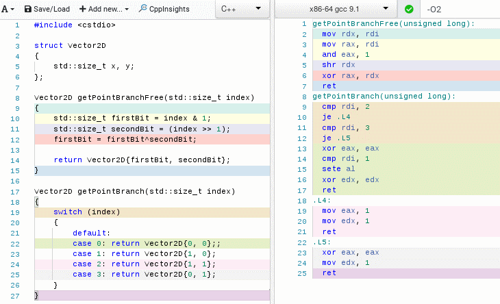
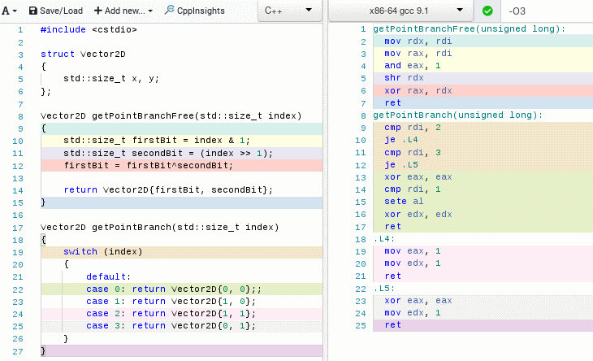

# Optimization-of-switch-statement
We're going to replace switch statement by bit manipulation and measure the impact.

## Function for optimization
Let's say we have function taking number in range [0, 3]. The function is returning 2 dimensional point in a following manner.
```
 f(0) = (0,0)
 f(1) = (1,0)
 f(2) = (1,1)
 f(3) = (0,1)
```
### First solution with switch
A straightforward solution is to use a switch statement with a case for each input. However it can affect execution speed of our program negatively.
```
switch (index)
{
  default:
  case 0: return Vector2D{0, 0};
  case 1: return Vector2D{1, 0};
  case 2: return Vector2D{1, 1};
  case 3: return Vector2D{0, 1};
}
```

### Problem with switch
Before program instructions are executed they need to be loaded and decoded by processor. But a processor doesn't know which branch to choose ahead whenever there is a condition (e.g. an switch, if-else statement) in code. If the wrong branch is chosen then the work of loading and decoding instruction is wasted. Moreover today's processors try to execute instructions speculatively in advance even though they could choose an incorrect branch. Which means choosing a wrong branch can affect execution time a lot more. To prevent that modern processor attempt to predict the right branch based on history of choosing that branch in past.

## Second solution without switch
In order to replace the switch statement, we need to rewrite input of function into bits.

```
input = 0 = 0000 0000  ==>  output = (0, 0)
input = 1 = 0000 0001  ==>  output = (1, 0)
input = 2 = 0000 0010  ==>  output = (1, 1)
input = 3 = 0000 0011  ==>  output = (0, 1)
```

Immediately we can observe that the second bit of input (from right to left) corresponds to the second coordinate in output. The next not so clear observation is that the first coordinate of output is equal to XOR operation of the first and the second bit of input.

```
0000 0000  ==> first bit=0, second bit=0, XOR(0, 0)=0  ==> (XOR(0, 0), second bit) = (0, 0)
0000 0001  ==> first bit=1, second bit=0, XOR(1, 0)=1  ==> (XOR(1, 0), second bit) = (1, 0)
0000 0010  ==> first bit=0, second bit=1, XOR(0, 1)=1  ==> (XOR(0, 1), second bit) = (1, 1)
0000 0011  ==> first bit=1, second bit=1, XOR(1, 1)=0  ==> (XOR(1, 1), second bit) = (0, 1)
```

The first bit can be extracted with AND operation using 1.
```
AND(0000 0000, 0000 0001) = 0000 0000 = 0
AND(0000 0001, 0000 0001) = 0000 0001 = 1
AND(0000 0010, 0000 0001) = 0000 0001 = 0
AND(0000 0011, 0000 0001) = 0000 0001 = 1
```

The second bit can be extracted with right shift operation >> using 1.
```
>>(0000 0000, 0000 0001) = 0000 0000 = 0
>>(0000 0001, 0000 0001) = 0000 0000 = 0
>>(0000 0010, 0000 0001) = 0000 0001 = 1
>>(0000 0011, 0000 0001) = 0000 0001 = 1
```

Implementation of the function with switch and without switch can be found here.

## Compiler translation into Assembler
Let's see briefly how code will be affected by compiler's optimizations.

### With -O0
Most optimizations are disabled.

- getPointBranchFree function has 15 assembler instructions.
- getPointBranch function has 24 assemlber instructions.

### With -O2
Most optimizations are performed, e.g. inlining small functions.

- getPointBranchFree function is reduced to 6 assembler instructions.
- getPointBranch function is reduced to 15 assembler instructions.

### With -O3
Even more optimizations, e.g. all functions are considered for inlining, even if they are not declared inline.

- there is no further optimization difference between -O2 and -O3 flag for these individual functions.

## Benchmark

The functions were benchmarked in a following way. We generate 3 types of sequences. Each sequence represents inputs for tested functions. The sequence is generated pseudorandomly by uniform distribution or by repeating a pattern (such as 0, 1, 2, 3, 0, 1, 2 ...) or just simply consist of single number (1, 1, 1, 1...). This approach is selected to examine impact of processor's branch prediction.

### Impact of predictions

### Observations:
- getPointBranchFree function gives steady performance independently of sequence types. It is due to a fact that BranchFree version doesn't rely on branch predictor.

- getPointBranch function heavily depends on sequence type and does not perform stable performance.

- With -O3 optimization getPointBranch processing repeated number is nearly 5 times faster than processing random numbers.  It is due to a fact that Branch version relies on branch predictor.

- With -O3 optimization getPointBranch can be as fast as getPointBranchFree function. However it only happens in case where the sequence repeats only the same number. In other word function with switch can be as fast as function without switch if processor can perfectly predict branches.

### Pseudorandom sequence {3, 3, 0, 0, 2, 1, 2, 2, 1, 0, ...}

### Sequence with pattern {0, 1, 2, 3, 0, 1, 2, 3, 0, 1, ...}

### Sequence with the same number {2, 2, 2, 2, 2, 2, 2, 2, 2, 2, ...}


### Observations:
- At first glance we see huge difference in performance between -O0 and -O2/-O3 flags.
- If minimal optimization (e.g. -O0 flag) is provided, then BranchFree version beats Branch version only in random sequence.
- Even though compiler with -O2 and -O3 produces same assembler code for individual getPointBranchFree and getPointBranch functions, there is still measurable performance gap between -O2 and -O3 flag.

## Conclusion
Function without switch statement provides stable and fast performance that does not rely on branch prediction of processor. It also provides less assembler instruction that gives more opportunity to inline function and possibly start further optimization.

## Compilation
```
g++ -std=c++11 -O3 main.cpp
```

## Program output
```
Branch version: 
0: ( 0, 0)
1: ( 1, 0)
2: ( 1, 1)
3: ( 0, 1)
-------------------------------------
BranchFree version: 
0: ( 0, 0)
1: ( 1, 0)
2: ( 1, 1)
3: ( 0, 1)

RANDOM SEQUENCE BENCHMARK TO COMPLICATE A CPU BRANCH PREDICTION
===============================================================
sequence: 1, 0, 1, 0, 0, 3, 3, 3, 1, 3, 0, 0, 3, 1, 1, ...
Branch version:
Result: (14996769,14997244), Elapsed time: 124 ms
Result: (14996769,14997244), Elapsed time: 123 ms
Result: (14996769,14997244), Elapsed time: 123 ms
Result: (14996769,14997244), Elapsed time: 123 ms
Result: (14996769,14997244), Elapsed time: 125 ms
-------------------------------------
Branch free version:
Result: (14996769,14997244), Elapsed time: 21 ms
Result: (14996769,14997244), Elapsed time: 22 ms
Result: (14996769,14997244), Elapsed time: 31 ms
Result: (14996769,14997244), Elapsed time: 26 ms
Result: (14996769,14997244), Elapsed time: 20 ms
===============================================================

PREDICTABLE SEQUENCE BENCHMARK TO SIMPLIFY A CPU BRANCH PREDICTION
==================================================================
sequence: 0, 1, 2, 3, 0, 1, 2, 3, 0, 1, 2, 3, 0, 1, 2, ...
Predictable sequence with pattern. Branch version:
Result: (15000000,15000000), Elapsed time: 43 ms
Result: (15000000,15000000), Elapsed time: 43 ms
Result: (15000000,15000000), Elapsed time: 42 ms
Result: (15000000,15000000), Elapsed time: 42 ms
Result: (15000000,15000000), Elapsed time: 42 ms
-------------------------------------
Predictable sequence with pattern. Branch free version:
Result: (15000000,15000000), Elapsed time: 27 ms
Result: (15000000,15000000), Elapsed time: 23 ms
Result: (15000000,15000000), Elapsed time: 23 ms
Result: (15000000,15000000), Elapsed time: 23 ms
Result: (15000000,15000000), Elapsed time: 25 ms
-------------------------------------
sequence: 2, 2, 2, 2, 2, 2, 2, 2, 2, 2, 2, 2, 2, 2, 2, ...
Predictable sequence fill with same number. Branch version:
Result: (30000000,30000000), Elapsed time: 22 ms
Result: (30000000,30000000), Elapsed time: 25 ms
Result: (30000000,30000000), Elapsed time: 29 ms
Result: (30000000,30000000), Elapsed time: 27 ms
Result: (30000000,30000000), Elapsed time: 24 ms
-------------------------------------
Predictable sequence fill with same number. Branch free version:
Result: (30000000,30000000), Elapsed time: 23 ms
Result: (30000000,30000000), Elapsed time: 25 ms
Result: (30000000,30000000), Elapsed time: 25 ms
Result: (30000000,30000000), Elapsed time: 23 ms
Result: (30000000,30000000), Elapsed time: 23 ms
==================================================================
```
